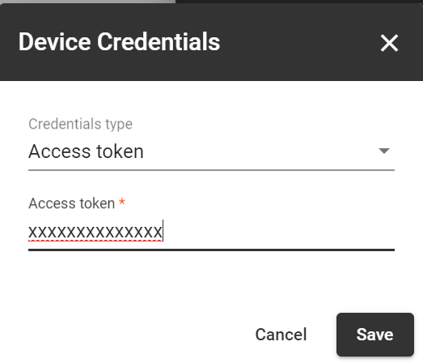

# Gateway 

[](./Gateway.ino)

| Files             | Remarks      |  Link                |
| ----------------- | ------------ | ---------------------|
| Gateway.ino       | Gateway Code | [Link](./Gateway.ino)|
| lora_code.h       | lora config  | [Link](./lora_code.h)|
| wifi_code.h       | WiFi config  | [Link](./wifi_code.h)|
| config.h          | common config| [Link](./config_v1.h)|

<br>

# Block Diagram

<p align="center">
  
</p>
# Code Implementation

```
void ESP_OnDataRecv(uint8_t *mac, uint8_t *incomingData, uint8_t len)
```
This function is a Callback function that will be executed when data is received from the WiFi node.

```
void RPC_callback(char *topic, uint8_t *message, unsigned int length)
```
This function is a Async RPC Callback function that will be executed when there is a RPC request coming from the Server.

```
void reconnect(int value)
```

Function which reestablish the connection with the sever as soon as it disconnects.

```
void lora_init()
```
Initialize the connection of LoRa module with MCU.

```
void lora_data()
```

Function segregates the received from the LoRa node and push data to server.

## **NOTE**

```
wifi_network_ssid = "WIFI_SSID"
wifi_network_pass = "WIFI_PASS"
mqtt_server       = "SERVER_IP_ADDR"
```
Add your WIFI_SSID, WIFI_PASS and Server IpAddress under ```config_v1.h```

```
LORA_TOKEN "LoRa_ACCESS_TOKEN"
```
Add your device access token under ```lora_code.h```

```
WIFI_TOKEN "WiFi_ACCESS_TOKEN"
```
Add your device access token under ```wifi_code.h```

<p align="center">
  
</p>
