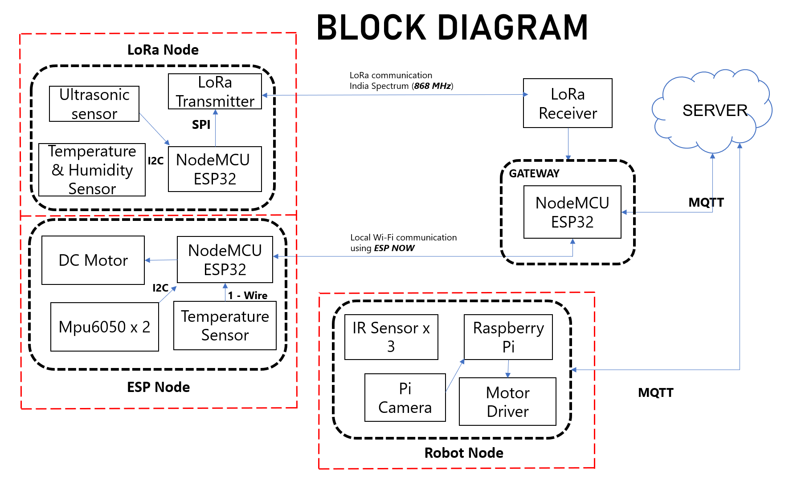
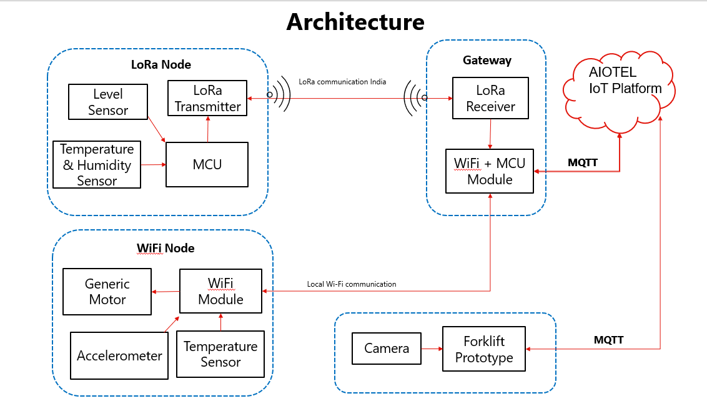

  

#

 

# Table of Contents 
- [Block Diagram](#section-1)
- [Installation](#section-2)
<!---# Block Diagram
-->
## Architecture 

  

## Installation 

Before starting the project, we need to to install the **ESP8266** Board to Arduino IDE.
Installation Instructions have been added to [Installation.md](installation.md).
