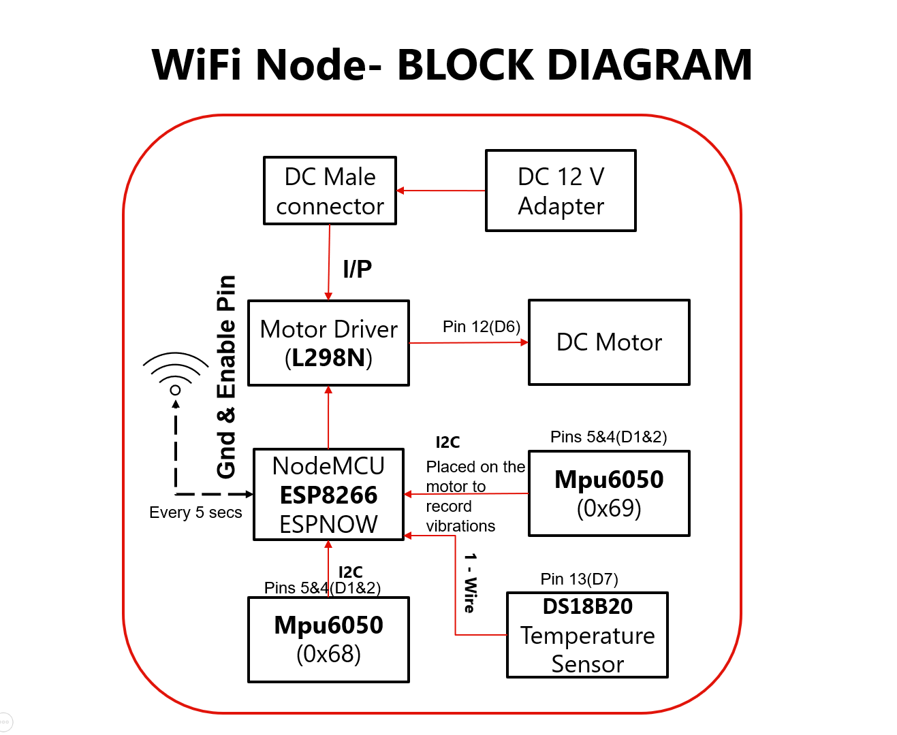
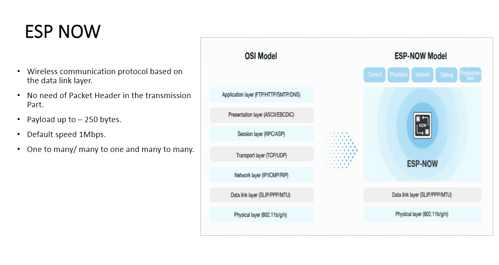

# WiFi EndNode
NodeMCU ESP8266 is used as the Main MCU. Mode of communication between WiFi Node and Gateway is **ESPNOW**.

# Block Diagram WiFi End Node

  

# ESP NOW - Key Benefits
- Quicker Controllable Response​
- Ultra-Low Power Consumption​
- Small in Size.​
- Long-distance Communication.​
- No Gateway and Receiving-IC Required​

# ESP NOW MODEL

  

# References
- [ESPRESSIF - ESPNOW](https://www.espressif.com/en/solutions/low-power-solutions/esp-now)
- [ESP866 - ESPNOW Source Code](https://github.com/esp8266/Arduino/tree/master/tools/sdk/include)
- [Tutorials](https://randomnerdtutorials.com/esp-now-esp8266-nodemcu-arduino-ide/)