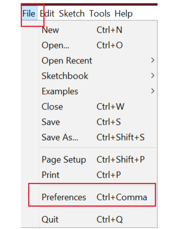

# Install ESP8266 Add-on in Arduino IDE

To install the ESP8266 board in your Arduino IDE, follow these next instructions:

1. In your Arduino IDE, go to **File> Preferences**

<!--  -->
<div style="text-align: center;">

</div>

2. Enter http://arduino.esp8266.com/stable/package_esp8266com_index.json into the “Additional Boards Manager URLs” field as shown in the figure below. Then, click the “OK” button:


**Note:** If you already have the ESP32 boards URL, you can separate the URLs with a comma as follows:

```
https://raw.githubusercontent.com/espressif/arduino-esp32/gh-pages/package_esp32_index.json,
https://arduino.esp8266.com/stable/package_esp8266com_index.json
```

3. Open the Boards Manager. Go to **Tools > Board > Boards Manager…**


4. Search for ESP8266 and press install button for the “ESP8266 by ESP8266 Community“:


5. That’s it. It should be installed after a few seconds.

